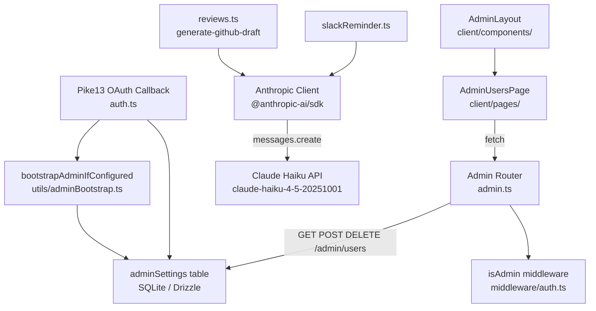

# Architecture Update — Sprint 002: Admin Access and Claude Haiku Integration

## Sprint Changes Summary

| Area | Before | After |
|---|---|---|
| Admin bootstrap | Manual DB insert required | `ADMIN_EMAILS` env var upsert at login |
| Admin user management API | No endpoint | `GET/POST/DELETE /api/admin/users` |
| Admin user management UI | No page | `/admin/users` page + sidebar link |
| AI provider — review generation | `groq-sdk`, `llama-3.3-70b-versatile` | `@anthropic-ai/sdk`, `claude-haiku-4-5-20251001` |
| AI provider — Slack reminders | `groq-sdk`, `GROQ_API_KEY` guard | `@anthropic-ai/sdk`, `ANTHROPIC_API_KEY` guard |
| Server dependency | `groq-sdk` present | `groq-sdk` removed; `@anthropic-ai/sdk` added |

---

## What Changed

### Module: Auth Route (`server/src/routes/auth.ts`)

**Purpose:** Authenticate users via Pike13 OAuth and establish a session.

**Boundary:** Owns the OAuth callback flow only. Does not own admin business
logic — it delegates to `adminSettings` table queries and now to a new
`bootstrapAdminIfConfigured` helper.

**Use cases served:** SUC-001

The Pike13 callback handler gains a bootstrap step immediately after the
existing `adminSettings` table lookup. Before evaluating `isAdmin`, the
handler calls `bootstrapAdminIfConfigured(normalizedEmail, db)`:

```
if email in ADMIN_EMAILS env var:
    INSERT OR IGNORE INTO admin_settings (email) VALUES (email)
```

This is an `onConflictDoNothing` upsert — safe to call on every login,
idempotent, and negligibly cheap.

The boolean `isAdmin` is then derived from the `adminSettings` lookup as
before. Because the upsert precedes the lookup (or the lookup is re-run
after the upsert), the user will have `isAdmin: true` on their first login.

The helper function lives in `server/src/utils/adminBootstrap.ts` to keep
it testable in isolation.

---

### Module: Admin Route (`server/src/routes/admin.ts`)

**Purpose:** Expose admin-only REST endpoints for managing the application.

**Boundary:** Protected by `isAdmin` middleware. Does not contain business
logic beyond data access.

**Use cases served:** SUC-002

Three new route handlers are added to the existing `adminRouter`:

| Method | Path | Description |
|--------|------|-------------|
| `GET` | `/api/admin/users` | Return all rows from `adminSettings` as `{ email, createdAt }[]` |
| `POST` | `/api/admin/users` | Body `{ email: string }` — upsert into `adminSettings`; 409 if already present |
| `DELETE` | `/api/admin/users/:email` | Remove from `adminSettings`; 409 if email matches session user; 404 if not found |

The self-removal guard uses `req.session.user!.email` from the existing
session type. No new session fields are required.

---

### Module: Admin Users Page (`client/src/pages/AdminUsersPage.tsx`)

**Purpose:** Provide a UI for admins to view and manage the admin user list.

**Boundary:** Reads and writes through the new `/api/admin/users` endpoints.
No direct DB or session access.

**Use cases served:** SUC-002

A new React page component with:
- A table of current admin emails with a "Remove" button per row.
- An "Add Admin" form (single email input + submit button).
- A confirmation dialog before any removal.
- Self-removal disabled in the UI (button absent or disabled for the
  current user's own row).

---

### Module: Admin Layout (`client/src/components/AdminLayout.tsx`)

**Purpose:** Render the shared admin sidebar and top bar.

**Boundary:** Presentational only — owns navigation links.

**Use cases served:** SUC-002

The `ADMIN_LINKS` array gains one entry:

```typescript
{ href: '/admin/users', label: 'Admin Users', Icon: UserCog }
```

---

### Module: AI Client — Reviews (`server/src/routes/reviews.ts`)

**Purpose:** Generate a progress review draft from a student's GitHub
activity using an LLM.

**Boundary:** Owns the GitHub API fetch logic and LLM call. Does not own
prompt storage or student data queries.

**Use cases served:** SUC-003

`groq-sdk` import and `Groq` client are replaced with `@anthropic-ai/sdk`
import and `Anthropic` client:

```typescript
import Anthropic from '@anthropic-ai/sdk';
// ...
const client = new Anthropic({ apiKey: process.env.ANTHROPIC_API_KEY });
const response = await client.messages.create({
  model: 'claude-haiku-4-5-20251001',
  max_tokens: 1024,
  system: '<existing system prompt>',
  messages: [{ role: 'user', content: '<existing user prompt>' }],
});
const llmBody = (response.content[0] as { type: 'text'; text: string }).text.trim();
```

The `GROQ_API_KEY` guard is replaced with `ANTHROPIC_API_KEY`:

```typescript
if (!process.env.ANTHROPIC_API_KEY) {
  res.status(500).json({ error: 'ANTHROPIC_API_KEY is not configured on the server' });
  return;
}
```

All prompt content is unchanged.

---

### Module: AI Client — Slack Reminder (`server/src/services/slackReminder.ts`)

**Purpose:** Send AI-enhanced Slack DMs to instructors with pending reviews.

**Boundary:** Owns Slack DM composition only. Falls back to static text
when the AI call fails or the API key is absent.

**Use cases served:** SUC-003

Same Groq→Anthropic swap as `reviews.ts`. The opt-in guard changes from
`if (process.env.GROQ_API_KEY)` to `if (process.env.ANTHROPIC_API_KEY)`.
The SDK call uses `messages.create` with the same prompts, same fallback
try/catch wrapper.

---

### Module: Server Dependencies (`server/package.json`)

**Purpose:** Declare runtime dependencies.

**Boundary:** Package manifest only.

**Use cases served:** SUC-003

`groq-sdk` is removed. `@anthropic-ai/sdk` is added.

---

### Module: Bootstrap Helper (`server/src/utils/adminBootstrap.ts`)

**Purpose:** Encapsulate the `ADMIN_EMAILS` check and upsert logic so it
can be unit-tested without importing the full auth route.

**Boundary:** Accepts `db` and `email` as parameters; returns `boolean`
indicating whether a bootstrap upsert was performed.

**Use cases served:** SUC-001

```typescript
export async function bootstrapAdminIfConfigured(
  email: string,
  db: DrizzleDb,
): Promise<boolean> {
  const adminEmails = (process.env.ADMIN_EMAILS ?? '')
    .split(',')
    .map((e) => e.trim().toLowerCase())
    .filter(Boolean);
  if (!adminEmails.includes(email)) return false;
  await db.insert(adminSettings).values({ email }).onConflictDoNothing();
  return true;
}
```

---

## Module Diagram



---

## Dependency Graph

```mermaid
graph LR
    authRoute[auth.ts] --> adminBootstrap[utils/adminBootstrap.ts]
    adminBootstrap --> drizzleDb[db/index.ts]
    adminBootstrap --> schema[db/schema.ts]

    adminRoute[admin.ts] --> drizzleDb
    adminRoute --> schema
    adminRoute --> isAdminMW[middleware/auth.ts]

    reviewsRoute[routes/reviews.ts] --> anthropicSdk[@anthropic-ai/sdk]
    slackReminder[services/slackReminder.ts] --> anthropicSdk

    adminUsersPage[AdminUsersPage.tsx] -->|HTTP| adminRoute
    adminLayout[AdminLayout.tsx] --> adminUsersPage
```

No circular dependencies. `adminBootstrap.ts` depends only on `db/index.ts`
and `db/schema.ts`, both of which are stable infrastructure modules.

---

## Why

**Admin bootstrap:** The stakeholder cannot use the app until their email is in
`adminSettings`. Direct DB access is impractical in a production Docker Swarm
environment. An env var is the standard pattern for first-admin bootstrapping:
it is set once at deploy time, does nothing on subsequent logins, and can be
removed from the env file after the first real login.

**Admin Users UI:** Without management tooling, adding a second admin requires
another manual DB operation. A simple CRUD page keeps future admin onboarding
entirely in-browser.

**Groq to Anthropic:** The stakeholder has an Anthropic key; the Groq key never
worked in their environment. The switch requires no prompt changes because both
providers follow an OpenAI-compatible message format. Claude Haiku is a cost-
effective model appropriate for the use case (structured review generation from
a fixed template).

---

## Impact on Existing Components

| Component | Impact |
|---|---|
| `server/src/routes/auth.ts` | One new helper call before `isAdmin` derivation |
| `server/src/routes/admin.ts` | Three new route handlers appended |
| `server/src/services/slackReminder.ts` | Groq import replaced; guard env var changed |
| `server/src/routes/reviews.ts` | Groq import replaced; guard env var changed; response access changed |
| `server/package.json` | `groq-sdk` removed; `@anthropic-ai/sdk` added |
| `client/src/components/AdminLayout.tsx` | One new nav link added to `ADMIN_LINKS` |
| `client/src/App.tsx` (or router) | New route `/admin/users → AdminUsersPage` |
| `config/*/public.env` | `ADMIN_EMAILS` key added |
| `config/*/secrets.env.example` | Comment clarifies `ANTHROPIC_API_KEY` is now required; `GROQ_API_KEY` removed if present |

---

## Migration Concerns

No database schema migration is required. The `adminSettings` table already
exists with the correct shape (`id`, `email`, `createdAt`).

No data migration is required. The bootstrap upsert is safe against an already-
populated table.

Deployment sequencing: `ADMIN_EMAILS` must be set in `config/prod/public.env`
before deploying. If it is not set, existing admin behaviour is unchanged (no
one is auto-promoted). The stakeholder should set `ADMIN_EMAILS` and then log
in once; after that, the env var can be cleared.

---

## Design Rationale

### Decision: `ADMIN_EMAILS` as a public env var (not a secret)

- **Context:** A list of admin email addresses does not contain credentials.
  It controls who can access admin pages but is not itself sensitive.
- **Alternatives considered:** Adding it to `secrets.env` to be consistent
  with other access-control settings.
- **Why this choice:** Public env vars are easier to rotate and share with
  the team. The email addresses are already visible in `adminSettings` to
  any admin. Keeping non-credential config in `public.env` follows the
  principle of least privilege for secrets management.
- **Consequences:** The value is visible in Docker Compose output and
  container inspects. Acceptable for email addresses.

### Decision: `onConflictDoNothing` upsert (not `onConflictDoUpdate`)

- **Context:** The bootstrap upsert runs on every login for an email in
  `ADMIN_EMAILS`.
- **Alternatives considered:** Check first, insert if absent (two DB calls);
  `onConflictDoUpdate` (would touch `createdAt`).
- **Why this choice:** A single idempotent insert with conflict ignore is
  the minimal, correct implementation. `createdAt` is preserved across logins.
  No extra round-trip.
- **Consequences:** None. The upsert is invisible after the first successful
  insert.

### Decision: Self-removal blocked at the API layer (not just the UI)

- **Context:** The "Admin Users" delete endpoint could be called directly.
- **Alternatives considered:** UI-only guard (CSS disable or hidden button).
- **Why this choice:** UI guards are trivially bypassed. An API-layer 409
  for self-removal is the correct defence-in-depth position. The UI guard
  is an additional UX improvement but not the primary safeguard.
- **Consequences:** The server must read `req.session.user.email` in the
  delete handler, which requires the session to be populated — already
  guaranteed by `isAdmin` middleware.

### Decision: Anthropic `messages.create` instead of a compatibility shim

- **Context:** The existing Groq calls use the OpenAI-compatible
  `chat.completions.create` interface. The Anthropic SDK uses
  `messages.create` with a different response shape.
- **Alternatives considered:** Using the Anthropic OpenAI-compatible
  endpoint (`https://api.anthropic.com/v1/`) via the `openai` SDK.
- **Why this choice:** The native Anthropic SDK is more explicit, provides
  better TypeScript types, and avoids an extra compatibility layer. The
  prompt content is unchanged; only the call site and response accessor
  differ. The change is contained to two files.
- **Consequences:** Reviewers must note the different response shape:
  `response.content[0].text` instead of
  `completion.choices[0].message.content`.

---

## Open Questions

1. **`ADMIN_EMAILS` removal after first login:** Should the runbook recommend
   removing the env var from `public.env` once the first admin is established?
   Leaving it in place is harmless (idempotent upsert) but could surprise
   future operators. Stakeholder input welcome.

2. **Anthropic SDK version:** `@anthropic-ai/sdk` should be pinned to a
   specific minor version in `package.json`. The implementer should check
   the current latest and pin accordingly.
