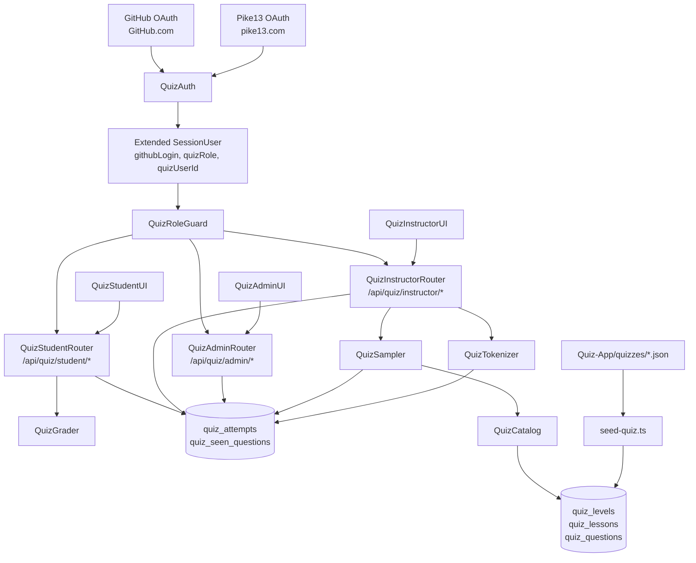
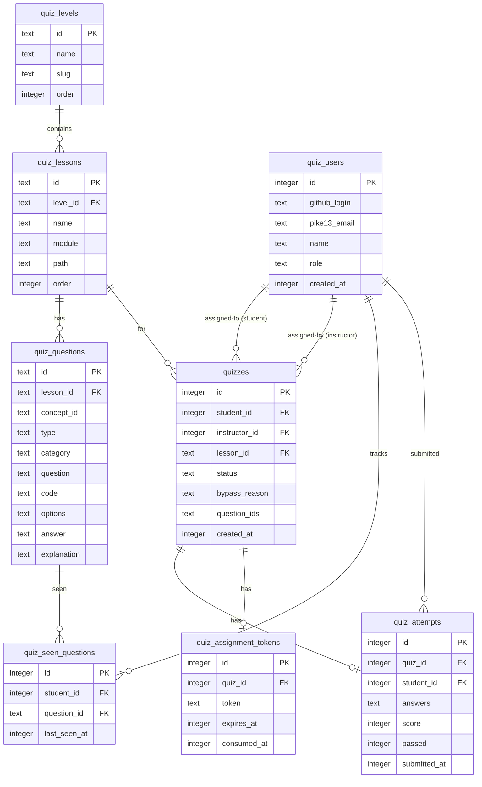
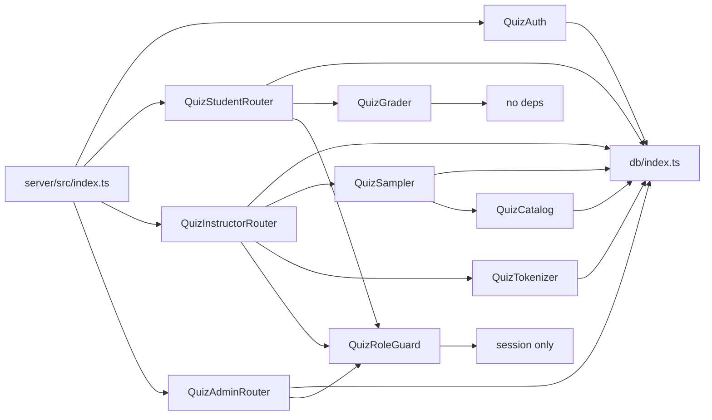

<!-- CLASI: Before changing code or making plans, review the SE process in CLAUDE.md -->

# Architecture Update — Sprint 002: Quiz App Foundation

## Sprint Changes Summary

| Area | Before | After |
|---|---|---|
| DB schema | LEAGUE Report tables only | + 8 quiz tables (`quiz_` prefix) |
| Auth strategies | Pike13 OAuth only | + GitHub OAuth (students) |
| SessionUser | `{ id, name, email, isAdmin, isActiveInstructor, instructorId }` | + `quizUserId`, `quizRole`, `githubLogin` |
| Route namespaces | `/api/auth`, `/api/reviews`, `/api/admin`, etc. | + `/api/quiz/student/*`, `/api/quiz/instructor/*`, `/api/quiz/admin/*` |
| Services | pike13*, email, scheduler | + grader, sampler, tokenizer (quiz sub-services) |
| Frontend routes | LEAGUE Report pages | + `/quiz/login`, `/quiz/dashboard`, `/quiz/t/:token`, `/quiz/take/:id`, `/quiz/result/:id`, `/instructor/quiz-tab`, `/admin/quiz/past-quizzes` |
| npm packages | — | No new packages (GitHub OAuth implemented manually) |
| Seed data | None | + `scripts/seed-quiz.ts` — loads `Quiz-App/quizzes/` banks |

---

## Step 1: Understand the Problem

Sprint 002 adds a complete quiz subsystem to the existing `progress-report` app.
The existing app authenticates staff via Pike13 OAuth, stores data in SQLite via
Drizzle, and serves a React SPA. The quiz subsystem needs a second auth path
(GitHub OAuth for students), new domain tables, three role-guarded API surface
areas, and corresponding frontend views. The design must not break the existing
LEAGUE Report functionality.

---

## Step 2: Responsibilities

| Responsibility | Module |
|---|---|
| Quiz domain data (levels, lessons, questions) | `QuizCatalog` — seeder + read-only query |
| User identity for quiz (GitHub + Pike13 mapped to quiz role) | `QuizAuth` — Passport strategies + session extension |
| Role enforcement + student isolation | `QuizRoleGuard` middleware |
| Sample 10 questions per lesson for a quiz | `QuizSampler` service |
| Grade a submitted attempt | `QuizGrader` service |
| Mint and resolve tokenized assignment links | `QuizTokenizer` service |
| Student-facing quiz API | `QuizStudentRouter` |
| Instructor-facing quiz API | `QuizInstructorRouter` |
| Admin-facing quiz API | `QuizAdminRouter` |
| Student frontend (login, dashboard, take, result, token entry) | `QuizStudentUI` |
| Instructor quiz tab frontend | `QuizInstructorUI` |
| Admin past-quizzes frontend | `QuizAdminUI` |

---

## Step 3: Module Definitions

### QuizCatalog (seeder + catalog API)

**Purpose:** Populate and expose the immutable quiz content (levels, lessons,
questions) from compiled JSON banks.

**Boundary:** Owns `quiz_levels`, `quiz_lessons`, `quiz_questions` tables.
Provides read-only queries to other modules. Never accepts writes from the API
layer. Does not touch student or assignment data.

**Use cases:** SUC-008, SUC-004 (lesson listing), SUC-007 (admin level/lesson
names).

### QuizAuth

**Purpose:** Authenticate students via GitHub OAuth and map both GitHub and
Pike13 identities to a unified `quizUsers` row with a role.

**Boundary:** Owns the GitHub OAuth Passport strategy and the `quizUsers`
table. Does not own the existing `users` / `instructors` tables. Staff roles
resolved from `INSTRUCTOR_ALLOWLIST` / `ADMIN_ALLOWLIST` env vars (parallel to
how the existing app uses `adminSettings`). Extends `SessionUser` with quiz
fields but does not replace it.

**Use cases:** SUC-001, SUC-003, SUC-004, SUC-005, SUC-006.

### QuizRoleGuard

**Purpose:** Enforce role-based access and student data isolation for all quiz
routes.

**Boundary:** Middleware only — reads `req.session.quizUser`, sets
`req.quizUser`. Provides `requireQuizRole(...roles)` and
`scopeToStudent(req)` helpers. Has no DB access of its own; callers pass the
student ID from `req.quizUser.id`.

**Use cases:** SUC-002, SUC-003, SUC-004, SUC-005, SUC-006, SUC-007.

### QuizTokenizer

**Purpose:** Mint expiring single-use tokens that let unauthenticated students
open a specific quiz.

**Boundary:** Owns `quiz_assignment_tokens` table. Provides `mint(quizId,
expiresInDays)` and `resolve(token)` (validates + returns quizId, marks
consumed). Has no knowledge of questions or grading.

**Use cases:** SUC-002, SUC-004.

### QuizSampler

**Purpose:** Select exactly 10 questions from a lesson's bank for a new quiz,
spread across concepts and prioritizing questions the student has not seen.

**Boundary:** Reads `quiz_questions` and `quiz_seen_questions`. Writes nothing.
Returns an ordered array of question IDs. Has no knowledge of routing or
responses.

**Use cases:** SUC-004.

### QuizGrader

**Purpose:** Score a set of student answers against the stored correct answers
deterministically.

**Boundary:** Stateless — receives `(questions, studentAnswers)`, returns
`{ score, passed, results }`. Does not read from or write to the DB. Owns the
normalization logic for short-answer comparison.

**Use cases:** SUC-002, SUC-006.

### QuizStudentRouter

**Purpose:** Expose the student-facing quiz API: list assigned quizzes, fetch
questions, submit attempts.

**Boundary:** All routes guarded by `requireQuizRole('student')` or token
resolution (for unauthenticated token path). Every query scoped to
`req.quizUser.id`. Calls QuizGrader and updates `quiz_seen_questions` and
`quiz_attempts`.

**Use cases:** SUC-002, SUC-003, SUC-006.

### QuizInstructorRouter

**Purpose:** Expose the instructor-facing quiz API: student lookup, quiz
assignment, instructor tab roster.

**Boundary:** All routes guarded by `requireQuizRole('instructor', 'admin')`.
Calls QuizSampler and QuizTokenizer. Owns assignment creation.

**Use cases:** SUC-004, SUC-005.

### QuizAdminRouter

**Purpose:** Expose the admin-facing quiz API: all attempts with full detail
and filters.

**Boundary:** All routes guarded by `requireQuizRole('admin')`. Read-only; no
mutations. Returns attempt + question + student data joined.

**Use cases:** SUC-007.

### QuizStudentUI

**Purpose:** Render the student quiz experience: GitHub login, dashboard,
quiz-taking form, result view, and token link entry point.

**Boundary:** React pages under `client/src/pages/quiz/`. Uses
`client/src/services/quiz/studentApi.ts` for all API calls. No direct DB or
server access.

**Use cases:** SUC-001, SUC-002, SUC-003, SUC-006.

### QuizInstructorUI

**Purpose:** Render the instructor quiz tab: student lookup, assign quiz form,
student-quiz roster.

**Boundary:** React pages/components under `client/src/pages/quiz/`. Added to
the existing `InstructorLayout`. Uses `instructorApi.ts`.

**Use cases:** SUC-004, SUC-005.

### QuizAdminUI

**Purpose:** Render the admin past-quizzes detail page with filter controls.

**Boundary:** React page under `client/src/pages/quiz/`. Added to the existing
`AdminLayout`. Uses `adminApi.ts`.

**Use cases:** SUC-007.

---

## Step 4: Diagrams

### Component / Module Diagram



### Entity-Relationship Diagram



### Dependency Graph



No circular dependencies. `QuizGrader` is a pure function with no imports.
Domain logic depends inward on `db/index.ts`; routers depend on services, not
vice versa.

---

## Step 5: Document Sections

### Data Model

All tables use the `quiz_` prefix. Drizzle table declarations go in a new file
`server/src/db/quiz-schema.ts`, imported by `server/src/db/schema.ts`.

**quiz_users**
```
id            integer PK autoincrement
github_login  text UNIQUE nullable    -- set for students
pike13_email  text UNIQUE nullable    -- set for staff
name          text NOT NULL
role          text NOT NULL           -- 'student' | 'instructor' | 'admin'
created_at    integer (timestamp ms)
```

**quiz_levels**
```
id    text PK    -- e.g. 'python-apprentice'
name  text NOT NULL
slug  text NOT NULL UNIQUE
order integer NOT NULL
```

**quiz_lessons**
```
id        text PK    -- e.g. 'python-apprentice/10_Welcome'
level_id  text FK -> quiz_levels.id
name      text NOT NULL
module    text NOT NULL
path      text NOT NULL
order     integer NOT NULL
```

**quiz_questions**
```
id          text PK    -- stable bank ID e.g. 'python-apprentice/10_Welcome/q01'
lesson_id   text FK -> quiz_lessons.id
concept_id  text nullable
type        text NOT NULL  -- 'multiple_choice' | 'short_answer'
category    text NOT NULL  -- 'theory' | 'coding' | 'game_dev'
question    text NOT NULL
code        text nullable
options     text (JSON array) nullable
answer      text NOT NULL
explanation text NOT NULL
```

**quizzes**
```
id            integer PK autoincrement
student_id    integer FK -> quiz_users.id
instructor_id integer FK -> quiz_users.id
lesson_id     text FK -> quiz_lessons.id
status        text NOT NULL DEFAULT 'assigned'  -- 'assigned' | 'completed'
bypass_reason text nullable
question_ids  text NOT NULL (JSON array of 10 question IDs)
created_at    integer (timestamp ms)
```

**quiz_attempts**
```
id           integer PK autoincrement
quiz_id      integer FK -> quizzes.id UNIQUE  -- one attempt per quiz
student_id   integer FK -> quiz_users.id
answers      text NOT NULL (JSON: { [questionId]: studentAnswer })
score        integer NOT NULL  -- 0-100
passed       integer NOT NULL (boolean)  -- 1 if score >= 70
submitted_at integer (timestamp ms)
```

**quiz_seen_questions**
```
id           integer PK autoincrement
student_id   integer FK -> quiz_users.id
question_id  text FK -> quiz_questions.id
last_seen_at integer (timestamp ms)
UNIQUE (student_id, question_id)
```

**quiz_assignment_tokens**
```
id          integer PK autoincrement
quiz_id     integer FK -> quizzes.id UNIQUE
token       text NOT NULL UNIQUE  -- crypto.randomUUID()
expires_at  integer NOT NULL (timestamp ms)  -- now + 30 days
consumed_at integer nullable (timestamp ms)
```

### API Route Map

All quiz routes are mounted under `/api/quiz`.

**Auth (no quiz role required)**
```
GET  /api/auth/github              -> redirect to GitHub OAuth
GET  /api/auth/github/callback     -> exchange code, create session, redirect
```

**Public / token**
```
GET  /api/quiz/token/:token        -> resolve token, return questions (no auth needed)
POST /api/quiz/token/:token/submit -> submit answers (no auth needed; student ID from quiz)
```

**Student (requireQuizRole('student'))**
```
GET  /api/quiz/student/quizzes              -> list my assigned quizzes
GET  /api/quiz/student/quizzes/:id/questions -> get questions for my quiz
POST /api/quiz/student/quizzes/:id/submit   -> submit answers + get result
GET  /api/quiz/student/quizzes/:id/result   -> get result for completed quiz
```

**Instructor (requireQuizRole('instructor', 'admin'))**
```
GET  /api/quiz/instructor/students?github=<login>  -> look up student
GET  /api/quiz/instructor/levels                   -> list levels + lessons
POST /api/quiz/instructor/assign                   -> assign quiz, mint token
GET  /api/quiz/instructor/my-students              -> roster with quiz summaries
```

**Admin (requireQuizRole('admin'))**
```
GET  /api/quiz/admin/attempts?from=&to=&studentId=&lessonId=  -> all attempts with detail
```

**Catalog (authenticated staff or student)**
```
GET  /api/quiz/levels              -> levels + lessons (for UI selectors)
```

### Auth Strategy Wiring

**GitHub OAuth (students):**
- Package: `passport-github2`
- Strategy name: `github`
- Callback URL: `/api/auth/github/callback`
- On success: find-or-create `quizUsers` row with `role = student`;
  extend session: `req.session.quizUser = { id, role: 'student', githubLogin }`.
- On failure: redirect to `/quiz/login?error=github`.

**Pike13 OAuth (staff — existing):**
- The existing Pike13 callback in `server/src/routes/auth.ts` is extended:
  after creating the LEAGUE Report session, also find-or-create a `quizUsers`
  row. Role is `admin` if the email is in `ADMIN_ALLOWLIST`; `instructor` if in
  `INSTRUCTOR_ALLOWLIST`; otherwise no quiz access.
- The existing `SessionUser` interface in `server/src/types/session.d.ts` gains
  optional fields: `quizUserId?: number`, `quizRole?: 'student' | 'instructor' | 'admin'`,
  `githubLogin?: string`.

**Token path (no session):**
- Routes under `/api/quiz/token/:token` do not require a session.
- The token middleware calls `QuizTokenizer.resolve(token)` and attaches
  `req.tokenQuiz = { quizId, studentId }` for downstream handlers.
- These routes are mounted before `requireQuizRole` and bypass session auth.

### Grading Service

File: `server/src/services/quiz/grader.ts`

```
gradeAttempt(questions: Question[], answers: Record<string, string>): GradeResult

GradeResult {
  score: number          // 0-100
  passed: boolean        // score >= 70
  results: QuestionResult[]
}

QuestionResult {
  questionId: string
  correct: boolean
  studentAnswer: string
  correctAnswer: string
  explanation: string
}
```

**Multiple-choice:** `studentAnswer === question.answer` (exact string match).

**Short-answer normalization:**
```
normalize(s) = s.trim().toLowerCase().replace(/\s+/g, ' ').replace(/['']/g, "'").replace(/[""]/g, '"')
```
Match: `normalize(studentAnswer) === normalize(question.answer)`.

**Scoring:** score = (number of correct answers / 10) × 100, rounded to nearest integer.

### Quiz Sampler Service

File: `server/src/services/quiz/sampler.ts`

```
sampleQuestions(lessonId: string, studentId: number, n = 10): Promise<string[]>
```

Algorithm:
1. Fetch all questions for `lessonId`.
2. Fetch `quiz_seen_questions` rows for this student, keyed by `question_id`.
3. Group questions by `concept_id`. Unseen questions are those with no row or
   a null `last_seen_at`.
4. Selection pass 1 — unseen: round-robin across concept groups, take one
   unseen question per concept group per round until `n` questions selected or
   unseen pool exhausted.
5. Selection pass 2 — top-up with least-recently-seen (ascending `last_seen_at`)
   until `n` questions selected.
6. Return ordered array of question IDs.

### Token Service

File: `server/src/services/quiz/tokenizer.ts`

```
mint(quizId: number, expiresInDays = 30): Promise<string>  // returns token UUID
resolve(token: string): Promise<{ quizId: number; studentId: number }>  // or throws
consume(token: string): Promise<void>
```

`resolve` throws `TokenExpiredError` (410) or `TokenConsumedError` (410) on
invalid states.

### Security / Role Guard

File: `server/src/middleware/quizAuth.ts`

```
requireQuizRole(...roles: QuizRole[]): RequestHandler
```

Reads `req.session.quizUser`. If no quiz user or role not in `roles`, returns
403. Sets `req.quizUser = req.session.quizUser` for downstream handlers.

Student isolation is enforced in the service layer: every `quizzes` and
`quiz_attempts` query includes `AND student_id = quizUser.id`. This is not
optional — it is the default query pattern for student routes.

### Frontend Routes

New routes added to `client/src/App.tsx`:

```
/quiz/login                     -> QuizLoginPage (public)
/quiz/dashboard                 -> QuizDashboardPage (student)
/quiz/take/:quizId              -> QuizTakePage (student)
/quiz/result/:quizId            -> QuizResultPage (student)
/quiz/t/:token                  -> QuizTokenPage (public - token entry)
/instructor/quiz                -> InstructorQuizTabPage (instructor)
/admin/quiz/past-quizzes        -> AdminPastQuizzesPage (admin)
```

`ProtectedRoute` is extended or duplicated with a `quizRole` variant that
checks `req.session.quizUser.quizRole`.

### Test Plan (4 layers)

**tests/db/** — Schema constraints and seeder
- `quiz-schema.test.ts`: verify all 8 quiz tables exist after migration; verify
  foreign key constraints; verify unique constraints (token uniqueness,
  seen-question uniqueness).
- `seed-quiz.test.ts`: run seeder against in-memory SQLite; assert counts
  (2 levels, 43 lessons, 543 questions); run twice, assert idempotent.

**tests/server/** — Route and service layer
- `grader.test.ts`: MC exact match pass/fail; short-answer normalization cases
  (mixed case, extra spaces, curly quotes); score calculation; passed threshold.
- `sampler.test.ts`: returns exactly 10 questions; unseen questions
  prioritized; concept spread; top-up with least-recently-seen.
- `quiz-student-routes.test.ts`: unauthenticated → 401; list quizzes returns
  only own; submit → grades and records; double-submit → 409; cross-student
  fetch → 403.
- `quiz-instructor-routes.test.ts`: non-instructor → 403; lookup by github
  → 200/404; assign → creates quiz + token; my-students includes quiz
  summaries.
- `quiz-admin-routes.test.ts`: non-admin → 403; attempts list returns all;
  date filter narrows results.
- `quiz-token-routes.test.ts`: valid token → questions; expired → 410;
  consumed → 410; submit via token → attempt recorded; second submit → 410.

**tests/client/** — React component layer
- `QuizDashboardPage.test.tsx`: renders quiz list; shows status badges.
- `QuizTakePage.test.tsx`: renders 10 questions; submit button disabled until
  all answered; calls submit API on submit.
- `QuizResultPage.test.tsx`: shows score, pass/fail badge, per-question
  explanation accordion.
- `InstructorQuizTabPage.test.tsx`: lookup form; assign button; renders
  student-quiz table.

**tests/e2e/** — Full-stack smoke
- `quiz-assign-take-grade.test.ts`: instructor login (Pike13 mock) → assign
  quiz to test student → follow tokenized link → submit answers → verify
  attempt recorded + score correct.

---

## Step 6: Design Rationale

### Decision: Separate `quiz_users` table rather than extending existing `users`

**Context:** The existing `users` table is identified by email + Pike13 OAuth.
Students authenticate via GitHub OAuth and may never have a Pike13 identity.

**Alternatives considered:** Add `github_login` column to `users`; use `users`
as the unified identity.

**Why this choice:** The existing `users` table is tightly coupled to
Pike13-only identity flows. Extending it would require touching the existing
auth route, the `SessionUser` type, and every query that reads `users`. A
separate `quiz_users` table isolates the quiz identity model, allows students
to exist without a Pike13 identity, and prevents any regression in the existing
LEAGUE Report flows. Staff who use both apps are linked by matching email.

**Consequences:** Quiz routes always query `quiz_users`, not `users`. The
session carries both `user` (LEAGUE Report) and `quizUser` (quiz) fields.

### Decision: `quiz_` prefix for all new tables

**Context:** The existing `users`, `instructors`, `students` tables serve the
LEAGUE Report. The quiz subsystem introduces `users` and `students` of its own.

**Alternatives considered:** Reuse existing tables; separate DB file.

**Why this choice:** Prefixing avoids name collisions without the complexity of
a second DB connection. It makes it clear at a glance which tables belong to
which subsystem.

**Consequences:** Quiz schema file is separate (`quiz-schema.ts`) and imported
by the main `schema.ts`. Migration is a single new file generated by drizzle-kit.

### Decision: Extend `SessionUser` rather than replace it

**Context:** The existing `SessionUser` has `isAdmin`, `isActiveInstructor`,
etc. used throughout the LEAGUE Report. The quiz needs `quizRole` and
`githubLogin`.

**Alternatives considered:** Replace `SessionUser` entirely; use a separate
session key for quiz state.

**Why this choice:** Using a separate optional `quizUser` sub-object on the
session avoids any risk to existing LEAGUE Report session reads. LEAGUE Report
code sees `req.session.user`; quiz code sees `req.session.quizUser`. These are
independent and can be null independently.

**Consequences:** `session.d.ts` gains an optional `quizUser` field. No
existing code needs to change.

### Decision: Stateless QuizGrader (pure function, no DB access)

**Context:** Grading requires questions and student answers.

**Alternatives considered:** Grader fetches questions from DB by ID.

**Why this choice:** A pure function is trivially testable, has no latency
beyond the computation, and is impossible to misuse. The route handler fetches
questions once, passes them to the grader, and writes results — no round-trips
inside the grader.

**Consequences:** Route handlers must fetch questions before calling grader.
This is a single `db.select().from(quiz_questions).where(inArray(...))`.

---

## Step 7: Open Questions

1. **Token expiry for assignment links:** The spec says "expiring link" but
   does not specify a duration. This architecture uses 30 days. Confirm whether
   instructors want a shorter expiry (e.g., 7 days for a typical weekly class).

2. **Session overlap for staff who also login with GitHub:** An instructor who
   authenticates via Pike13 OAuth will have `req.session.user` set but no
   `req.session.quizUser.githubLogin`. Should a staff member's GitHub login be
   linkable to their `quiz_users` row so they can see their own quiz history if
   they were ever a student? Defer unless stakeholder raises it.

3. **`passport` package addition — RESOLVED:** The existing app does NOT use
   Passport — it implements OAuth manually in `routes/auth.ts`. GitHub OAuth
   will follow the same manual pattern (exchange code → fetch profile → create
   session). No `passport` or `passport-github2` dependency is added. The npm
   packages row in the Sprint Changes Summary is updated accordingly.

4. **Seed script trigger:** The bank seeder can run at server startup
   (idempotent upsert, minimal cost on subsequent starts) or as an explicit
   `npm run seed:quiz` command. Recommendation: run at startup with a guard
   (`IF NOT EXISTS` / upsert semantics) so the first deploy always has data.
   Confirm preferred approach.

5. **Student isolation enforcement layer:** The architecture enforces student
   isolation in the service layer (all queries include `AND student_id = X`).
   Should there be an additional middleware-level assertion that the requested
   resource's `student_id` matches `req.quizUser.id` (defense in depth)?
   Recommendation: yes — add a `assertOwnQuiz(quizId, studentId)` helper called
   before every quiz/attempt read.

---

## What Changed

This sprint introduces the quiz subsystem as an integrated extension of the
existing `progress-report` app. No existing modules are modified except:

1. `server/src/db/schema.ts` — imports new `quiz-schema.ts`.
2. `server/src/routes/auth.ts` — Pike13 callback extended to populate
   `quiz_users` row and set `req.session.quizUser` for staff.
3. `server/src/types/session.d.ts` — `SessionData` gains optional `quizUser`.
4. `server/src/index.ts` — registers GitHub OAuth callback route and quiz
   sub-routers.
5. `client/src/App.tsx` — adds quiz routes.

New files created:

- `server/src/db/quiz-schema.ts` — 8 Drizzle table definitions
- `server/drizzle/<timestamp>_quiz-schema.sql` — generated migration
- `server/src/services/quiz/grader.ts`
- `server/src/services/quiz/sampler.ts`
- `server/src/services/quiz/tokenizer.ts`
- `server/src/routes/quiz/student.ts`
- `server/src/routes/quiz/instructor.ts`
- `server/src/routes/quiz/admin.ts`
- `server/src/routes/quiz/token.ts`
- `server/src/middleware/quizAuth.ts`
- `server/scripts/seed-quiz.ts`
- `client/src/pages/quiz/QuizLoginPage.tsx`
- `client/src/pages/quiz/QuizDashboardPage.tsx`
- `client/src/pages/quiz/QuizTakePage.tsx`
- `client/src/pages/quiz/QuizResultPage.tsx`
- `client/src/pages/quiz/QuizTokenPage.tsx`
- `client/src/pages/quiz/InstructorQuizTabPage.tsx`
- `client/src/pages/quiz/AdminPastQuizzesPage.tsx`
- `client/src/services/quiz/studentApi.ts`
- `client/src/services/quiz/instructorApi.ts`
- `client/src/services/quiz/adminApi.ts`
- `client/src/types/quiz.ts`
- `tests/db/quiz-schema.test.ts`
- `tests/db/seed-quiz.test.ts`
- `tests/server/grader.test.ts`
- `tests/server/sampler.test.ts`
- `tests/server/quiz-student-routes.test.ts`
- `tests/server/quiz-instructor-routes.test.ts`
- `tests/server/quiz-admin-routes.test.ts`
- `tests/server/quiz-token-routes.test.ts`
- `tests/client/QuizDashboardPage.test.tsx`
- `tests/client/QuizTakePage.test.tsx`
- `tests/client/QuizResultPage.test.tsx`
- `tests/client/InstructorQuizTabPage.test.tsx`
- `tests/e2e/quiz-assign-take-grade.test.ts`

---

## Why

The League needs a structured way to assess student knowledge against curriculum
progress. Students (minors) need frictionless access (tokenized links). Staff
need visibility into results. Integrating into the existing app reuses Pike13
OAuth, SendGrid, SQLite, and the deploy pipeline — no new operational surface.

---

## Impact on Existing Components

| Component | Impact |
|---|---|
| `server/src/db/schema.ts` | Add `export * from './quiz-schema'` |
| `server/src/routes/auth.ts` | Add `quiz_users` upsert + `quizUser` session set in Pike13 callback |
| `server/src/types/session.d.ts` | Add optional `quizUser: QuizSessionUser` to `SessionData` |
| `server/src/index.ts` | Register GitHub callback + quiz routers; add `passport` if chosen |
| `client/src/App.tsx` | Add quiz routes + `ProtectedRoute` quiz-role variant |
| All existing routes | No change — they do not touch quiz tables or `quizUser` session field |
| Drizzle migration | New migration file added; existing migrations unchanged |

---

## Migration Concerns

No existing data is affected. The 8 new quiz tables are created by a new
migration generated with `drizzle-kit generate`. Existing migration files are
unchanged.

The seeder must run before any quiz API call; at startup this is guaranteed if
the seed runs during server initialization (after migration). The `quiz_levels`,
`quiz_lessons`, and `quiz_questions` tables will be empty until seeded —
instructor assign calls will return 404 for any lesson until the seed completes.

New environment variables required before deploying:
- `GITHUB_CLIENT_ID`
- `GITHUB_CLIENT_SECRET`
- `INSTRUCTOR_ALLOWLIST` (comma-separated Pike13 emails)
- `ADMIN_ALLOWLIST` (comma-separated Pike13 emails)
